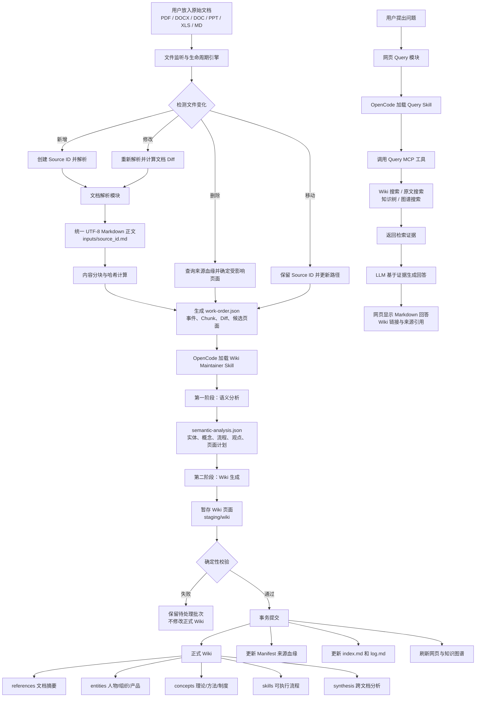

# LLM Wiki：文档解析、Wiki 构建与 Query 问答全流程

## 一、整体流程图



## 二、文档进入系统

### 输入

```text
raw/sources/
├── 文档.pdf
├── 制度.doc
├── 报告.docx
├── 演示文稿.ppt
├── 数据.xls
└── 笔记.md
```

### 做了什么

Python 生命周期引擎扫描原始资料目录，根据文件路径、SHA-256 和 Manifest 判断文件属于新增、修改、删除、移动、恢复还是内容未变化。

### 输出

系统为每份资料维护一个稳定的 Source 记录：

```json
{
  "source_id": "src_d8bb0518378944ab",
  "path": "raw/sources/海尔集团绩效管理手册.pdf",
  "sha256": "文件哈希",
  "state": "active"
}
```

`source_id` 是文档的稳定身份。文件移动时路径可以变化，但 Source ID 保持不变。

## 三、文档解析

### 输入

PDF、Word、PowerPoint、Excel、Markdown 等原始文件。

### 做了什么

- PDF：提取页面文本。
- DOC/DOCX：提取段落。
- PPT/PPTX：提取幻灯片文本。
- XLS/XLSX：提取工作表和单元格。
- Markdown/TXT：直接读取。
- 图片：交给具备视觉能力的模型处理。

### 输出

统一保存为 UTF-8 Markdown：

```text
.wiki-state/batches/<批次ID>/inputs/<source_id>.md
```

示例：

```markdown
# Extracted source

- source_id: `src_d8bb0518378944ab`
- source_path: `raw/sources/海尔集团绩效管理手册.pdf`

---

# 海尔集团绩效管理手册

## 绩效管理体系

PBC 是海尔集团使用的绩效管理方法……
```

文档解析阶段只负责还原内容，不负责判断实体、概念和 Wiki 页面。

## 四、内容分块与文档 Diff

### 输入

解析后的完整 Markdown 文本。

### 做了什么

系统按段落和长度拆分内容，为每个 Chunk 生成稳定 ID、SHA-256、原文顺序、字符数和内容预览。文档修改时，对新旧 Chunk 进行 Diff，识别新增、删除和未变化内容。

### 输出

```json
{
  "chunks": [
    {
      "chunk_id": "chk_4a175ea8ca0b248b",
      "sha256": "内容哈希",
      "ordinal": 0,
      "chars": 1796,
      "preview": "PBC 是海尔集团使用的绩效管理方法……"
    }
  ],
  "diff": {
    "added_count": 1,
    "removed_count": 1,
    "unchanged_count": 20,
    "unchanged_chunk_ids": ["chk_001", "chk_002"]
  }
}
```

修改少量内容时，只需处理变化部分，不需要重新分析整篇文档。

## 五、生成 Wiki 构建工作单

### 输入

- 文件变化事件。
- Source ID。
- Markdown 正文路径。
- Chunk 与文档 Diff。
- 受影响的 Wiki 页面。
- 页面身份匹配候选。

### 做了什么

生命周期引擎将本次需要处理的内容组织成结构化同步任务。

### 输出

```text
.wiki-state/batches/<批次ID>/work-order.json
```

```json
{
  "batch_id": "20260831T141442Z-e32bae72",
  "events": [
    {
      "kind": "modified",
      "reason": "content_changed",
      "source_id": "src_d8bb0518378944ab",
      "path": "raw/sources/海尔集团绩效管理手册.pdf",
      "extracted_path": ".wiki-state/batches/.../inputs/src_d8bb0518378944ab.md",
      "chunks": [],
      "diff": {},
      "affected_pages": [
        "references/海尔集团绩效管理手册.md",
        "concepts/PBC绩效管理.md"
      ],
      "identity_candidates": []
    }
  ]
}
```

## 六、OpenCode Skill 第一阶段：语义分析

### 输入

OpenCode 读取：

- `work-order.json`。
- `inputs/<source_id>.md`。
- `purpose.md`。
- `schema.md`。
- `wiki/index.md`。
- 相关已有 Wiki 页面。

### 做了什么

LLM 分析文档中的关键实体、关键概念、操作流程、主要观点、与已有 Wiki 的关系、重复页面以及页面创建或合并计划。

### 输出

```text
semantic-analysis.json
```

```json
{
  "version": 1,
  "batch_id": "20260831T141442Z-e32bae72",
  "sources": [
    {
      "source_id": "src_d8bb0518378944ab",
      "source_path": "raw/sources/海尔集团绩效管理手册.pdf",
      "entities": ["海尔集团"],
      "concepts": ["PBC绩效管理", "关键业绩指标"],
      "procedures": ["绩效考核流程"],
      "arguments": ["绩效管理需要目标、沟通和评价形成闭环"],
      "existing_matches": ["concepts/PBC绩效管理.md"],
      "page_plan": [
        {
          "path": "entities/海尔集团.md",
          "category": "entities",
          "title": "海尔集团",
          "action": "create"
        },
        {
          "path": "concepts/PBC绩效管理.md",
          "category": "concepts",
          "title": "PBC绩效管理",
          "action": "merge"
        }
      ],
      "skipped_candidates": []
    }
  ]
}
```

第一阶段只做分析和规划，不直接修改正式 Wiki。

## 七、OpenCode Skill 第二阶段：生成 Wiki

### 输入

- `semantic-analysis.json`。
- 原始解析内容。
- 已有 Wiki 页面。
- Schema 页面规范。

### 做了什么

根据第一阶段计划创建或修改以下页面：

- `references/`：具体文档摘要。
- `entities/`：人物、企业、组织、产品。
- `concepts/`：理论、制度、方法、指标。
- `skills/`：可执行操作流程。
- `synthesis/`：跨文档比较和综合结论。

### 输出

页面先写入暂存区：

```text
.wiki-state/batches/<批次ID>/staging/wiki/
├── references/
├── entities/
├── concepts/
├── skills/
└── synthesis/
```

每个页面包含来源血缘：

```yaml
---
title: "PBC绩效管理"
category: "concepts"
wiki_managed: true
source_ids: ["src_d8bb0518378944ab"]
sources: ["raw/sources/海尔集团绩效管理手册.pdf"]
---
```

重要知识还会记录 Claim 来源：

```markdown
PBC 通过目标制定、过程沟通和结果评价形成绩效闭环。

<!-- wiki-claim:
{"id":"clm_pbc_cycle",
 "source_ids":["src_d8bb0518378944ab"],
 "chunk_ids":["chk_4a175ea8ca0b248b"]}
-->
```

## 八、校验与事务提交

### 输入

暂存 Wiki 页面、语义分析结果和来源记录。

### 做了什么

Python 引擎检查：

- 是否完成第一阶段语义分析。
- 页面是否存在于 `page_plan`。
- 页面分类和目录是否一致。
- Source ID 和来源路径是否匹配。
- Claim 引用的 Chunk 是否存在。
- 是否出现重复页面身份。
- 处理过程中原文是否再次变化。
- 用户是否同时修改正式 Wiki。
- 删除来源后是否仍残留失效知识。

### 输出

校验失败：保留 pending batch，不修改正式 Wiki。

校验成功：将暂存页面事务提交到正式 `wiki/`，同时更新：

```text
.wiki-state/manifest.json
wiki/index.md
wiki/log.md
```

## 九、删除和修改如何维护 Wiki

### 修改文档

```text
检测文件哈希变化
→ 重新解析
→ Chunk Diff
→ 找出受影响 Claim
→ Skill 局部重写
→ 校验并提交
```

### 删除文档

```text
Source 被删除
→ Manifest 查询关联页面
→ 删除独占 Claim
→ 共享 Claim 保留其他来源
→ 无剩余来源的页面进入回收区
→ 清理失效 Wikilink
→ 更新索引和图谱
```

删除的页面不会立即永久清除，而是进入：

```text
.wiki-trash/<批次ID>/
```

## 十、网页和知识图谱

### 输入

正式 `wiki/` 目录中的 Markdown 页面。

### 做了什么

网页后端读取页面 frontmatter、正文、`[[wikilink]]`、共享 Source、共同邻居和页面类型。

### 输出

- Wiki 目录树。
- Markdown 正文。
- 页面数量。
- 知识关系图谱。
- 节点类型与关系强度。

图谱中的节点代表 Wiki 页面，边可能来自：

```text
直接 Wikilink
+ 共享原始来源
+ 共同邻居
+ 页面类型亲和
```

# Query 问答链路

## 十一、用户提交问题

### 输入

```text
海尔的 PBC 绩效管理是什么？
```

### 做了什么

网页将问题发送给 OpenCode 并加载 Query Skill。Query Skill 判断应该查询 Wiki、原文还是图谱，并调用相应 MCP 工具。

## 十二、调用 Query MCP

Query MCP 提供四类工具：

| MCP 工具 | 作用 |
| --- | --- |
| `knowledge_tree` | 查看知识库目录与页面结构 |
| `wiki_search` | 搜索已生成的 Wiki 知识 |
| `source_search` | 搜索原始文档解析内容 |
| `graph_search` | 搜索页面关系和关联路径 |

### 输入

```json
{
  "query": "海尔的PBC绩效管理是什么？"
}
```

### 输出

```json
{
  "results": [
    {
      "path": "concepts/PBC绩效管理.md",
      "title": "PBC绩效管理",
      "score": 0.91,
      "content": "PBC通过目标制定、过程沟通和结果评价……"
    },
    {
      "path": "entities/海尔集团.md",
      "title": "海尔集团",
      "score": 0.83,
      "content": "海尔集团在绩效管理中采用PBC方法……"
    }
  ]
}
```

## 十三、LLM 生成最终回答

### 输入

- 用户问题。
- MCP 返回的 Wiki 证据。
- 原始资料证据。
- 页面引用路径。

### 做了什么

LLM 根据检索证据组织答案；知识库没有覆盖时明确说明知识缺口，避免编造。

### 输出

网页可渲染的 Markdown：

```markdown
## PBC绩效管理

PBC是海尔集团采用的绩效管理方法，主要包括：

1. 目标制定
2. 过程沟通
3. 结果评价

参考页面：

- [[concepts/PBC绩效管理]]
- [[entities/海尔集团]]
```

网页随后完成 Markdown 渲染、Wikilink 跳转、引用展示和对话历史保存。

## 十四、输入输出总表

| 阶段 | 输入 | 做了什么 | 输出 |
| --- | --- | --- | --- |
| 文件监听 | Raw Source | 判断新增、修改、删除、移动 | Source 事件 |
| 文档解析 | PDF、Word、PPT、Excel 等 | 提取统一文本 | `inputs/<source_id>.md` |
| 内容分块 | Markdown 全文 | 分段、哈希、Diff | Chunk 与 Diff |
| 生成工作单 | 事件、Chunk、页面信息 | 组织同步任务 | `work-order.json` |
| 语义分析 | 工作单、原文、已有 Wiki | 抽取实体、概念、流程 | `semantic-analysis.json` |
| Wiki 生成 | 语义分析结果 | 创建、合并、修改页面 | `staging/wiki/` |
| 校验提交 | 暂存页面 | 血缘、身份、冲突校验 | 正式 `wiki/` |
| 图谱展示 | Wiki 页面 | 解析链接和关系 | 网页关系图谱 |
| Query 路由 | 用户问题 | Skill 选择 MCP 工具 | 检索请求 |
| MCP 检索 | Query、Wiki、Source、Graph | 搜索相关证据 | 证据集合 |
| 回答生成 | 问题与证据 | LLM 组织回答 | Markdown 回答与引用 |
