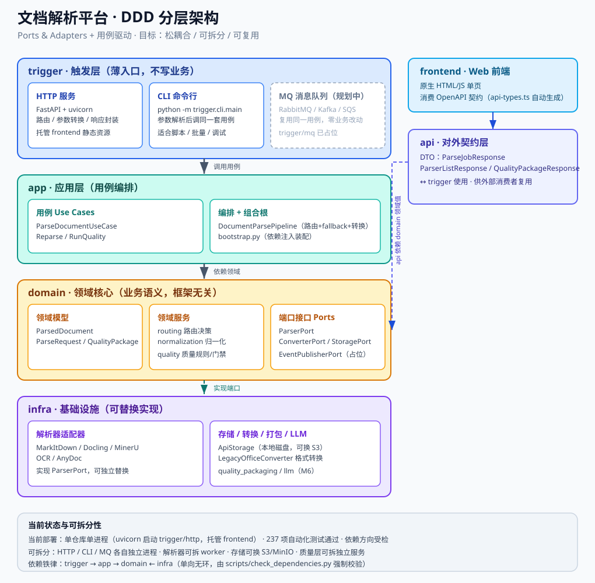
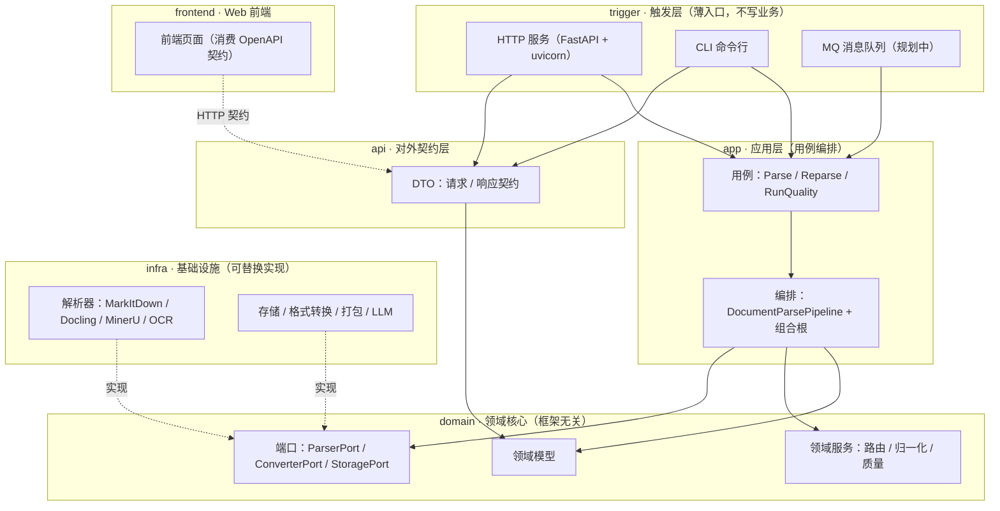

# 文档解析平台 · 架构说明（管理层概览）

> 一句话总结：平台已按 **DDD 分层 + 端口适配器** 重构完成——业务核心与具体技术解耦，Web、命令行、未来的消息队列共用同一套业务用例，换解析器、换存储、拆服务都不需要改业务代码。

---

## 1. 架构图



> 图上双击/浏览器打开 `docs/architecture-diagram.svg` 可放大查看；下方附同构的 Mermaid 版本，可在 GitHub、VSCode 等直接渲染。



---

## 2. 分层职责

| 层 | 职责 | 通俗理解 |
| --- | --- | --- |
| `trigger` 触发层 | HTTP 路由、CLI 入口、未来的 MQ 消费 | 只负责"接客"，不写业务 |
| `app` 应用层 | 用例编排、事务边界、依赖装配 | 业务流程的"总指挥" |
| `domain` 领域核心 | 领域模型、路由决策、质量规则、端口接口 | 平台的"大脑"，与技术无关 |
| `infra` 基础设施 | 解析器、存储、格式转换、打包、LLM | 具体"干活的工具"，可随时换 |
| `api` 契约层 | 对外请求/响应 DTO | 前后端 / 系统间的"合同" |
| `frontend` 前端 | Web 页面 | 独立消费者，只认契约 |

依赖铁律（单向、无环，由自动化脚本强制校验）：

```text
trigger → app → domain ← infra
    └──────→ api → domain
```

---

## 3. 松耦合的关键：端口与适配器

平台把"可能会被替换的外部能力"抽象成端口（接口），具体实现放在基础设施层。**换实现不碰业务代码**：

| 端口（业务侧契约） | 当前实现 | 可替换为 |
| --- | --- | --- |
| 解析端口 ParserPort | MarkItDown / Docling / MinerU / OCR / AnyDoc | 新解析器、云端解析服务、独立 worker |
| 转换端口 ConverterPort | LibreOffice 旧格式转换 | 在线转换服务 |
| 存储端口 StoragePort | 本地磁盘 ApiStorage | S3 / MinIO / 对象存储 |
| 事件端口 EventPublisherPort（占位） | 未接入 | 消息队列 / 日志 / 内部通知 |

**新增解析器 = 加一个适配器 + 登记注册，不改任何业务代码。**

---

## 4. 多入口复用：一套用例服务所有渠道

HTTP、CLI（以及规划中的 MQ）都调用**同一套**应用层用例，行为完全一致、零重复：

- 当前：`uvicorn` 启动 HTTP 服务并托管前端页面；`python -m trigger.cli.main` 命令行解析同一入口。
- 规划：MQ 消费者直接复用用例，异步批量解析只需新增一个触发入口。
- 可拆分：各入口可独立部署为独立进程/镜像，领域与应用层作为共享核心库发布。

---

## 5. 对业务的收益

- **松耦合**：换解析器、换存储、换部署方式，不动业务代码，降低变更风险。
- **可拆分**：解析、质量、存储、入口可拆成独立服务/进程，按需扩容。
- **可复用**：Web、命令行、未来 MQ 共用一套用例，行为一致、避免重复开发。
- **可维护**：代码边界清晰、按层组织测试，新人上手和交接成本低。

---

## 6. 当前进度

| 项目 | 状态 |
| --- | --- |
| 分层落地 + 依赖方向校验 | ✅ 完成（`scripts/check_dependencies.py` 强制单向依赖） |
| 端口与适配器 | ✅ 完成（解析/转换/存储可替换） |
| 多入口复用（HTTP + CLI） | ✅ 完成 |
| 前后端契约收敛（OpenAPI → 前端类型自动生成） | ✅ 完成 |
| 自动化测试 | ✅ 237 项通过 |
| MQ 消息队列接入 | ⏳ 规划中（`trigger/mq` 已占位，端口已声明） |
| 可选独立部署（解析/质量拆独立服务） | ⏳ 按需推进 |

> 说明：`backend/` 旧兼容目录已无任何引用，代码已全部迁入新分层，目录删除为收尾动作（不影响运行）。

---

## 7. 技术栈

- 后端：Python 3.11 · FastAPI · pydantic · uvicorn
- 解析引擎：MarkItDown / Docling / MinerU / OCR / AnyDoc（适配器可插拔）
- 前端：原生 HTML / JS（类型由后端 OpenAPI 契约自动生成）
- 存储：本地文件系统（当前），可平滑替换对象存储
- 质量层：自研证据驱动质量流水线（规则 / 门禁 / 修复）