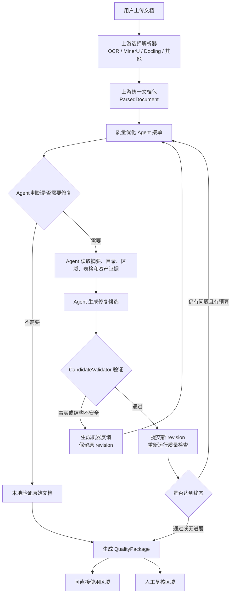
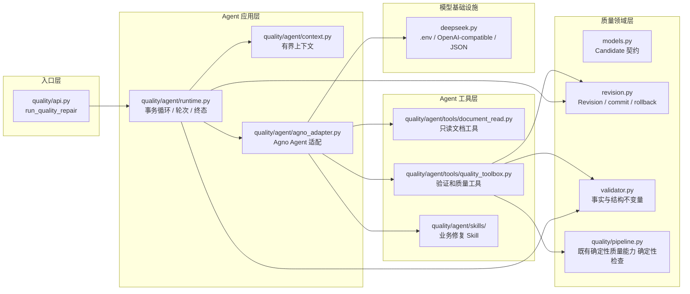
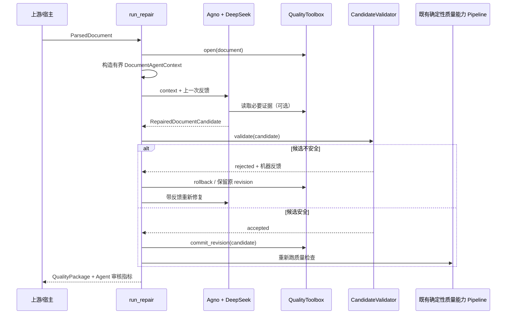

# 质量优化 Agent：业务流程与架构设计

> 这份文档描述当前已经落地的 单文档质量修复 Agent 第一阶段，不是脱离代码的概念方案。  
> 运行时：Agno 2.9+；当前模型接入：DeepSeek OpenAI-compatible API。  
> 处理粒度：一次只修复一个文档。

## 1. 先说业务：用户上传一个文档后会发生什么

LLMwiki 的用户不会关心我们内部有多少条规则。他上传论文、扫描件、表格或截图后，期望拿到一份“可以直接使用的文档”，同时知道哪些地方仍然需要人工确认。

因此，质量层的业务目标是：让 LLM 负责理解不确定的问题，让本地程序负责守住不能被改动的事实边界。



最后交给 LLMwiki 负责人的不是一段聊天记录，而是三类可消费产物：

- 修复后的 Markdown；
- 带结构绑定和稳定 ID 的 JSON；
- 审核文件：哪些区域可以直接使用，哪些区域必须人工复核。

如果 Agent 修错了，系统不会把错误内容直接交出去，而是让候选回到验证和反馈环节。

## 2. 具体架构：每一层各自负责什么



对应到代码，调用关系是：

| 层 | 代码 | 主要职责 |
| --- | --- | --- |
| 入口层 | `quality/api.py` | 创建文档专属 session，通过 `agent_factory(toolbox)` 绑定 Agent 和 revision |
| 应用层 | `quality/agent/runtime.py` | 控制一轮轮 Agent 调用、反馈、最大轮次和终态 |
| Agent 适配层 | `quality/agent/agno_adapter.py` | 把 Agno 的 `Agent.run()` 转换成项目的候选契约 |
| 上下文层 | `quality/agent/context.py`、`index.py` | 先生成页面级文档索引，再按需提供有限上下文，避免把整个 revision 状态暴露出去 |
| Prompt 层 | `quality/agent/prompts.py` | 集中管理模板、默认行为约束、Prompt 版本和截断策略 |
| Skill 层 | `quality/agent/skills/` | 提供阅读顺序、标题、表格、引用和跨页等判断 playbook，不直接修改文档 |
| 工具层 | `quality/agent/tools/` | 提供读取、页面/跨页上下文、验证、差异和质量检查；事务操作由宿主 runtime 执行 |
| 领域层 | `models.py`、`revision.py`、`validator.py` | 定义候选、版本、指纹和不可变事实规则 |
| 既有质量层 | `quality/pipeline.py` 及 既有确定性质量能力 | 规则检查、Gate、canonical、审核和四件套输出 |
| 模型层 | `quality/agent/deepseek.py` | 读取 `.env`，构造 DeepSeek 模型并处理 provider 兼容性 |

这里最重要的边界是：Agent 可以提出候选，但不能直接改 `ParsedDocument`。Agent 只拥有读取和验证工具；真正的 commit、rollback 和最终打包由宿主事务循环在本地验证后执行。

## 3. 一次调用内部的真实顺序



Agent 的具体修复策略不写死在宿主代码里。宿主只决定三件事：给它多少上下文、最多允许几轮、什么候选才算安全。

页面模式由 runtime 负责编排：先发出 overview 进度事件，再按页或跨页上下文调用 Agent。进度通过 RepairProgressEvent 回调输出，CLI/Web 层可以自行渲染进度条；Skill 不负责进度和事务。

## 4. Agent 看什么、改什么

Agent 首轮拿到的是文档元信息、页面级 `DocumentIndex`、块摘要、当前 Markdown 和稳定的 `base_revision`。它先用索引了解全篇结构，需要深入判断时再按稳定 ID 调用局部工具：

- `get_document_summary()`：文档类型、块/表格/资产数量和能力状态；
- `get_document_index()`：页数、每页稳定 ID、标题、结构计数和短预览；
- `get_document_outline()`：标题树和章节路径；
- `get_page_context()`：指定页的 block、表格和邻页索引；
- `get_neighbor_page_context()`：相邻页的轻量结构摘要；
- `get_cross_page_table_context()`：跨页表格的完整结构证据；
- `get_region_context()`：指定块的局部 Markdown 和锚点；
- `get_table_context()`：表格网格和单元格绑定；
- `get_asset_context()`：图片/附件的元数据；
- `get_revision_digest()`：revision 和内容指纹。

它输出的是 `RepairedDocumentCandidate`，而不是任意 JSON。大文档页面任务优先输出最小结构化 operations：

```text
base_revision       候选基线
repaired_markdown   修复后的全文 Markdown
block_markdown      可选的块级修复
operations          move/update_heading/replace_table/upsert_relation 等最小 Patch
affected_ids        受影响的 block/table 稳定 ID
affected_relation_keys 受影响的显式关系 key
affected_asset_paths   受影响的资源路径
evidence_refs       修复依据
change_kind         format / structure / none
reasoning           给审核和调试看的理由
```

允许的变化是排版、结构和格式；事实词元、数字、专有名词、来源绑定、稳定 ID 以及不属于候选范围的内容都必须保持不变。

## 5. 为什么需要 Revision 和 Validator

LLM 可能会：

- 误把 OCR 错字当成格式问题并自行改写；
- 为了让表格看起来完整而补造数据；
- 在第二轮修复时基于旧版本提交候选；
- 返回格式正确、但事实已经变化的 Markdown。

所以每次修复都是一个小事务：

```text
当前 revision
   ↓
Agent 候选
   ↓
CandidateValidator
   ├─ 失败：记录原因，原 revision 不变
   └─ 通过：commit 新 revision，再跑 既有确定性质量能力
```

这不是为了限制 Agent 的判断能力，而是把“判断”和“落盘”分开：LLM 可以自由提出修复方案，但只有可验证的方案才会成为正式结果。

## 6. DeepSeek/Agno 的当前配置

根目录 `.env`：

```dotenv
LLM_API_KEY=<your-key>
LLM_API_BASE=https://api.deepseek.com
LLM_MODEL=deepseek-v4-flash
```

Prompt 模板位于 `quality/agent/prompts.py`，`context.py` 只负责把文档数据交给模板渲染；Agno 适配器只负责发送渲染后的 Prompt。

`build_deepseek_model()` 当前负责：

- 使用 DeepSeek 的 OpenAI-compatible endpoint；
- 把 `developer` 风格消息映射为 DeepSeek 可接受的角色；
- 使用 `json_object`，再由 Pydantic 校验候选；
- 关闭 V4 thinking，避免当前 Agno 工具多轮协议缺少 `reasoning_content`；
- 设置单请求 60 秒超时、关闭隐式重试；
- 让 Agno 单次运行最多调用 8 次工具。

## 7. 失败时业务上怎么处理

- 模型接口失败：原文档仍然保留，审核文件标记为人工复核；
- 候选改变事实：拒绝提交，把具体原因反馈给 Agent；
- 候选没有进展：停止循环，避免重复消耗模型调用；
- 达到最大轮次：使用最后一个可验证 revision，不能为了“看起来修好了”强行提交；
- 任何最终输出都重新经过 既有确定性质量能力 质量流水线。

## 8. 性能认识与后续优化

单纯让模型回答一句话通常只需要一次请求；完整 Agent 还可能包含读取工具、候选生成、验证反馈、重新生成和质量流水线，因此耗时更长。当前默认边界是 12,000 字符上下文、3 个修复轮次、8 次工具调用和 60 秒单请求超时；超大文档可通过 RepairAgentConfig(mode=paged) 按页运行。

后续优化会优先做三件事：

1. 首轮只给模型最必要的读取工具；
2. 把验证、提交和回滚继续留在宿主侧，减少模型往返；
3. 对超长文档按章节/区域读取，而不是一次发送整篇文档。

## 9. 当前实现状态

第一阶段已经打通 Agno Agent、DeepSeek 配置、Skill 目录、页面索引、结构化 Patch、候选验证、revision 提交/回滚和 QualityPackage 生成。当前本地测试基线为 `225 passed, 1 xfailed`。

仍待后续联调的内容包括：上游正式统一文档包、百页级文档的分区修复策略、多文档并行调度，以及代表性真实文档的性能压测。
